# *Diccionario de Datos*

# Diccionario de Datos Ejercicio 1

## 1. Información General

| Elemento | Valor                   |
| :------- | :---------------------- |
| Proyecto | Hospital                |
| Versión  | 1.0                     |
| Fecha    | Junio 2026              |
| Elaboró  | Julio Cesar Lugo Rodriguez |
| SGBD     | SQL Server              |

---

## 2. Descripción de la Base de Datos

Esta base de datos administra la información de:

* Paciente
* Expediente Médico

Permite registrar la información de los pacientes y mantener un expediente médico único para cada uno, garantizando la integridad de la información.

---

## 3. Catálogo de Restricciones

| Catálogo | Significado               |
| :------- | :------------------------ |
| PK       | Primary Key               |
| FK       | Foreign Key               |
| NN       | Not Null                  |
| UQ       | Unique                    |
| AI       | Auto Increment o Identity |
| CK       | Check                     |
| DF       | Default                   |

---

## 4. Diccionario de Datos

### **Tabla:** *Paciente*

**Descripción**

Almacena la información personal de los pacientes registrados en el hospital.

| Campo       | Tipo    | Longitud | Restricciones | Descripción                       |
| :---------- | :------ | :------- | :------------ | :-------------------------------- |
| NumPaciente | INT     | -        | PK, NN        | Identificador único del paciente. |
| Nombre      | VARCHAR | 50       | NN            | Nombre del paciente.              |
| Apellido1   | VARCHAR | 50       | NN            | Primer apellido del paciente.     |
| Apellido2   | VARCHAR | 50       | NULL          | Segundo apellido del paciente.    |
| FechaNaci   | DATE    | -        | NN            | Fecha de nacimiento del paciente. |

---

### **Tabla:** *Expediente*

**Descripción**

Almacena la información del expediente médico asignado a cada paciente.

| Campo         | Tipo    | Longitud | Restricciones | Descripción                                |
| :------------ | :------ | :------- | :------------ | :----------------------------------------- |
| NumExpediente | INT     | -        | PK, NN        | Identificador único del expediente médico. |
| FechaApertura | DATE    | -        | NN            | Fecha en que se abrió el expediente.       |
| TipoSangre    | VARCHAR | 5        | NN            | Tipo de sangre del paciente.               |
| NumPaciente   | INT     | -        | FK, UQ, NN    | Paciente al que pertenece el expediente.   |

---

## 5. Relaciones en la Base de Datos

| Relación              | Cardinalidad | Descripción                                                                                    |
| :-------------------- | :----------- | :--------------------------------------------------------------------------------------------- |
| Paciente → Expediente | 1:1          | Cada paciente tiene un único expediente médico y cada expediente pertenece a un solo paciente. |

---

## 6. Matriz de Claves Foráneas

| Tabla      | Campo FK    | Referencias           |
| :--------- | :---------- | :-------------------- |
| Expediente | NumPaciente | Paciente(NumPaciente) |

---

## 7. Integridad Referencial

| Clave | Regla                                                             |
| :---- | :---------------------------------------------------------------- |
| IR-01 | No se puede registrar un expediente para un paciente inexistente. |
| IR-02 | No puede existir un expediente médico sin un paciente asociado.   |
| IR-03 | Cada paciente solo puede tener un expediente médico.              |

---

## 8. Reglas del Negocio

| Clave | Regla                                                             |
| :---- | :---------------------------------------------------------------- |
| RN-01 | Cada paciente debe tener exactamente un expediente médico.        |
| RN-02 | Cada expediente médico pertenece a un único paciente.             |
| RN-03 | No puede existir un expediente médico sin un paciente registrado. |
| RN-04 | No puede existir un paciente sin expediente médico.               |

---

## 9. Diagrama Relacional
## Ejercicio 1

### Modelo E-R
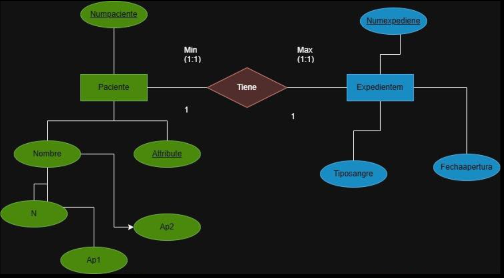

### Modelo Relacional
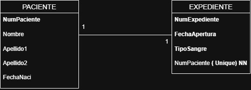

--

# Diccionario de Datos Ejercicio 2

---

# 1. Información General

| Campo | Información |
| :----- | :---------- |
| Proyecto | Sistema de Gestión de Cursos |
| Versión | 1.0 |
| Fecha | Junio 2026 |
| Elaboró  | Julio Cesar Lugo Rodriguez |
| SGBD | SQL Server |

---

# 2. Descripción de la Base de Datos

La base de datos administra la información correspondiente a los profesores, los cursos impartidos y las especialidades asociadas a cada profesor.

El sistema permite registrar la información de los profesores, almacenar los cursos que imparten y controlar las especialidades de cada uno.

Las tablas principales que conforman la base de datos son:

- Profesor
- Curso
- Especialidad

El objetivo principal de la base de datos es mantener organizada la información académica referente a los profesores y los cursos que imparten, garantizando la integridad y consistencia de los datos.

---

# 3. Catálogo de Restricciones

| Catálogo | Significado |
| :-------- | :---------- |
| PK | Primary Key |
| FK | Foreign Key |
| NN | Not Null |
| UQ | Unique |
| AI | Auto Increment o Identity |
| CK | Check |
| DF | Default |

---

# 4. Diccionario de Datos

## Tabla: Profesor

### Descripción

Almacena la información general de los profesores.

| Campo | Tipo | Longitud | Restricciones | Descripción |
| :---- | :--- | :------- | :------------ | :---------- |
| NumProfesor | INT | 4 | PK, NN | Identificador único del profesor |
| Nombre | VARCHAR | 50 | NN | Nombre del profesor |
| Apellido1 | VARCHAR | 50 | NN | Primer apellido |
| Apellido2 | VARCHAR | 50 | NN | Segundo apellido |

---

## Tabla: Curso

### Descripción

Almacena la información de los cursos impartidos por los profesores.

| Campo | Tipo | Longitud | Restricciones | Descripción |
| :---- | :--- | :------- | :------------ | :---------- |
| NumCurso | INT | 4 | PK, NN | Identificador único del curso |
| NombreCurso | VARCHAR | 100 | NN | Nombre del curso |
| Creditos | INT | 2 | NN | Número de créditos del curso |
| Profesor | INT | 4 | FK, NN | Profesor que imparte el curso |

---

## Tabla: Especialidad

### Descripción

Almacena las especialidades registradas para cada profesor.

| Campo | Tipo | Longitud | Restricciones | Descripción |
| :---- | :--- | :------- | :------------ | :---------- |
| Especialidad | INT | 4 | PK, NN | Identificador de la especialidad |
| Nombre | VARCHAR | 100 | NN | Nombre de la especialidad |
| Profesor | INT | 4 | FK, NN | Profesor al que pertenece la especialidad |

---

# 5. Relaciones en la Base de Datos

| Relación | Cardinalidad | Descripción |
| :-------- | :----------- | :---------- |
| Profesor → Curso | 1 : N | Un profesor puede impartir varios cursos. |
| Profesor → Especialidad | 1 : N | Un profesor puede tener una o varias especialidades. |

---

# 6. Matriz de Claves Foráneas

| Tabla | Campo FK | Referencias |
| :---- | :------- | :---------- |
| Curso | Profesor | Profesor(NumProfesor) |
| Especialidad | Profesor | Profesor(NumProfesor) |

---

# 7. Integridad Referencial

| Clave | Regla |
| :---- | :---- |
| Curso.Profesor | Debe existir previamente un profesor registrado. |
| Especialidad.Profesor | Debe existir previamente un profesor registrado. |

---

# 8. Reglas del Negocio

| Clave | Regla |
| :---- | :---- |
| RN-01 | Cada profesor debe tener un identificador único. |
| RN-02 | Un profesor puede impartir uno o varios cursos. |
| RN-03 | Cada curso debe ser impartido por un único profesor. |
| RN-04 | Un profesor puede registrar una o varias especialidades. |
| RN-05 | Cada especialidad pertenece únicamente a un profesor. |
| RN-06 | El número de créditos de un curso debe ser mayor que cero. |

---

# 9. Diagrama Relacional
## Ejercicio 2

### Modelo E-R
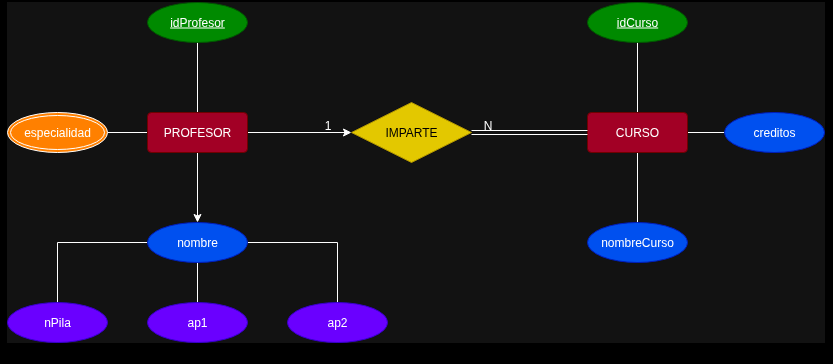

### Modelo Relacional

--

# Diccionario de Datos Ejercicio 3

## 1. Información General

| Elemento | Valor                   |
| :------- | :---------------------- |
| Proyecto | Escuela                 |
| Versión  | 1.0                     |
| Fecha    | Junio 2026              |
| Elaboró  | Julio Cesar Lugo rodriguez |
| SGBD     | SQL Server              |

---

## 2. Descripción de la Base de Datos

Esta base de datos administra la información de:

* Alumno
* Materia
* Inscribe

Permite registrar los alumnos, las materias disponibles y las inscripciones realizadas por cada alumno, almacenando la fecha de inscripción y la calificación obtenida.

---

## 3. Catálogo de Restricciones

| Catálogo | Significado               |
| :------- | :------------------------ |
| PK       | Primary Key               |
| FK       | Foreign Key               |
| NN       | Not Null                  |
| UQ       | Unique                    |
| AI       | Auto Increment o Identity |
| CK       | Check                     |
| DF       | Default                   |

---

## 4. Diccionario de Datos

### **Tabla:** *Alumno*

**Descripción**

Almacena la información de los alumnos inscritos en la institución.

| Campo     | Tipo    | Longitud | Restricciones | Descripción                         |
| :-------- | :------ | :------- | :------------ | :---------------------------------- |
| NumAlumno | INT     | -        | PK, NN        | Identificador único del alumno.     |
| Matricula | VARCHAR | 15       | UQ, NN        | Matrícula institucional del alumno. |
| Nombre    | VARCHAR | 50       | NN            | Nombre del alumno.                  |
| Ap1       | VARCHAR | 50       | NN            | Primer apellido del alumno.         |
| Ap2       | VARCHAR | 50       | NULL          | Segundo apellido del alumno.        |
| Semestre  | INT     | -        | NN            | Semestre que cursa el alumno.       |

---

### **Tabla:** *Materia*

**Descripción**

Almacena la información de las materias disponibles.

| Campo        | Tipo    | Longitud | Restricciones | Descripción                       |
| :----------- | :------ | :------- | :------------ | :-------------------------------- |
| ClaveMateria | VARCHAR | 10       | PK, NN        | Clave única de la materia.        |
| Nombre       | VARCHAR | 100      | UQ, NN        | Nombre de la materia.             |
| Creditos     | INT     | -        | NN            | Número de créditos de la materia. |

---

### **Tabla:** *Inscribe*

**Descripción**

Registra las materias en las que se inscribe cada alumno.

| Campo            | Tipo    | Longitud | Restricciones | Descripción                                |
| :--------------- | :------ | :------- | :------------ | :----------------------------------------- |
| NumAlumno        | INT     | -        | PK, FK, NN    | Alumno inscrito.                           |
| ClaveMateria     | VARCHAR | 10       | PK, FK, NN    | Materia inscrita.                          |
| FechaInscripcion | DATE    | -        | NN            | Fecha en que se realizó la inscripción.    |
| Calificaciones   | DECIMAL | 4,2      | NN            | Calificación final obtenida por el alumno. |

---

## 5. Relaciones en la Base de Datos

| Relación           | Cardinalidad | Descripción                                                                   |
| :----------------- | :----------- | :---------------------------------------------------------------------------- |
| Alumno → Inscribe  | 1:N          | Un alumno puede tener varias inscripciones.                                   |
| Materia → Inscribe | 1:N          | Una materia puede estar asociada a muchos alumnos mediante las inscripciones. |

---

## 6. Matriz de Claves Foráneas

| Tabla    | Campo FK     | Referencias           |
| :------- | :----------- | :-------------------- |
| Inscribe | NumAlumno    | Alumno(NumAlumno)     |
| Inscribe | ClaveMateria | Materia(ClaveMateria) |

---

## 7. Integridad Referencial

| Clave | Regla                                                                      |
| :---- | :------------------------------------------------------------------------- |
| IR-01 | No se puede registrar una inscripción para un alumno inexistente.          |
| IR-02 | No se puede registrar una inscripción para una materia inexistente.        |
| IR-03 | Cada inscripción debe estar asociada a un alumno y una materia existentes. |

---

## 8. Reglas del Negocio

| Clave | Regla                                                                            |
| :---- | :------------------------------------------------------------------------------- |
| RN-01 | Un alumno puede inscribirse en varias materias.                                  |
| RN-02 | Una materia puede tener varios alumnos inscritos.                                |
| RN-03 | Puede existir una materia sin alumnos inscritos.                                 |
| RN-04 | Todo alumno debe estar inscrito en al menos una materia.                         |
| RN-05 | De cada inscripción se almacena la fecha de inscripción y la calificación final. |

---

## 9. Diagrama Relacional
### Modelo E-R
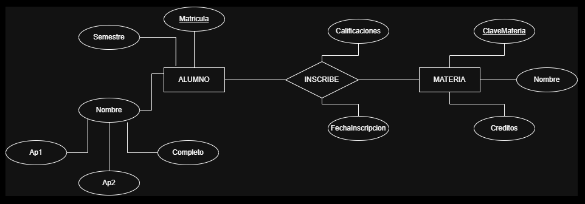

### Modelo Relacional
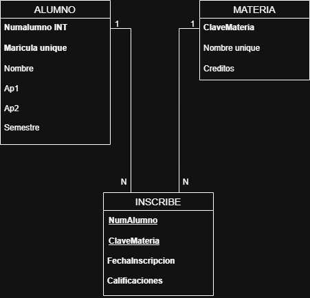

--

# Diccionario de Datos Ejercicio 4

---

# 1. Información General

| Campo | Información |
| :----- | :---------- |
| Proyecto | Sistema de Gestión de Pedidos |
| Versión | 1.0 |
| Fecha | Junio 2026 |
| Elaboró | Julio Cesar Lugo Rodriguez |
| SGBD | SQL Server |

---

# 2. Descripción de la Base de Datos

La base de datos administra la información correspondiente al registro de clientes, pedidos realizados y los productos comercializados.

El sistema permite almacenar los pedidos efectuados por cada cliente y registrar el detalle de los productos vendidos en cada pedido, incluyendo el precio de venta y la cantidad vendida.

Las tablas principales que conforman la base de datos son:

- Cliente
- Pedido
- Producto
- DetallePedido

El objetivo principal de la base de datos es mantener la integridad de la información relacionada con las ventas, permitiendo consultar clientes, pedidos y productos de manera eficiente.

---

# 3. Catálogo de Restricciones

| Catálogo | Significado |
| :-------- | :---------- |
| PK | Primary Key |
| FK | Foreign Key |
| NN | Not Null |
| UQ | Unique |
| AI | Auto Increment o Identity |
| CK | Check |
| DF | Default |

---

# 4. Diccionario de Datos

## Tabla: Cliente

### Descripción

Almacena la información general de los clientes registrados.

| Campo | Tipo | Longitud | Restricciones | Descripción |
| :---- | :--- | :------- | :------------ | :---------- |
| NumCliente | INT | 4 | PK, NN, AI | Identificador del cliente |
| Nombre | VARCHAR | 50 | NN | Nombre del cliente |
| Apellido1 | VARCHAR | 50 | NN | Primer apellido |
| Apellido2 | VARCHAR | 50 | NN | Segundo apellido |

---

## Tabla: Pedido

### Descripción

Almacena los pedidos realizados por los clientes.

| Campo | Tipo | Longitud | Restricciones | Descripción |
| :---- | :--- | :------- | :------------ | :---------- |
| NumPedido | INT | 4 | PK, NN, AI | Identificador del pedido |
| FechaPedido | DATE | - | NN | Fecha del pedido |
| Cliente_fk | INT | 4 | FK, NN | Cliente que realizó el pedido |

---

## Tabla: Producto

### Descripción

Almacena la información de los productos disponibles para venta.

| Campo | Tipo | Longitud | Restricciones | Descripción |
| :---- | :--- | :------- | :------------ | :---------- |
| NumProducto | INT | 4 | PK, NN, AI | Identificador del producto |
| Nombre | VARCHAR | 100 | NN, UQ | Nombre del producto |
| Precio | DECIMAL | 10,2 | NN | Precio del producto |

---

## Tabla: DetallePedido

### Descripción

Relaciona los pedidos con los productos vendidos.

| Campo | Tipo | Longitud | Restricciones | Descripción |
| :---- | :--- | :------- | :------------ | :---------- |
| NumPedido_fk | INT | 4 | PK, FK, NN | Pedido asociado |
| NumProducto_fk | INT | 4 | PK, FK, NN | Producto vendido |
| PrecioVenta | DECIMAL | 10,2 | NN | Precio de venta del producto |
| CantidadVendida | INT | 4 | NN, CK | Cantidad vendida |

---

# 5. Relaciones en la Base de Datos

| Relación | Cardinalidad | Descripción |
| :-------- | :----------- | :---------- |
| Cliente → Pedido | 1 : N | Un cliente puede realizar varios pedidos |
| Pedido → DetallePedido | 1 : N | Un pedido puede contener varios productos |
| Producto → DetallePedido | 1 : N | Un producto puede aparecer en varios pedidos |

---

# 6. Matriz de Claves Foráneas

| Tabla | Campo FK | Referencias |
| :---- | :------- | :---------- |
| Pedido | Cliente_fk | Cliente(NumCliente) |
| DetallePedido | NumPedido_fk | Pedido(NumPedido) |
| DetallePedido | NumProducto_fk | Producto(NumProducto) |

---

# 7. Integridad Referencial

| Clave | Regla |
| :---- | :---- |
| Pedido.Cliente_fk | Debe existir previamente un cliente registrado. |
| DetallePedido.NumPedido_fk | Debe existir previamente un pedido. |
| DetallePedido.NumProducto_fk | Debe existir previamente un producto. |

---

# 8. Reglas del Negocio

| Clave | Regla |
| :---- | :---- |
| RN-01 | Un cliente puede registrar uno o varios pedidos. |
| RN-02 | Cada pedido pertenece a un único cliente. |
| RN-03 | Un pedido debe contener al menos un producto. |
| RN-04 | Un producto puede venderse en diferentes pedidos. |
| RN-05 | La cantidad vendida debe ser mayor que cero. |
| RN-06 | El precio de venta debe ser mayor que cero. |
| RN-07 | El nombre del producto debe ser único. |

---

# 9. Diagrama Relacional
### Modelo E-R

### Modelo Relacional
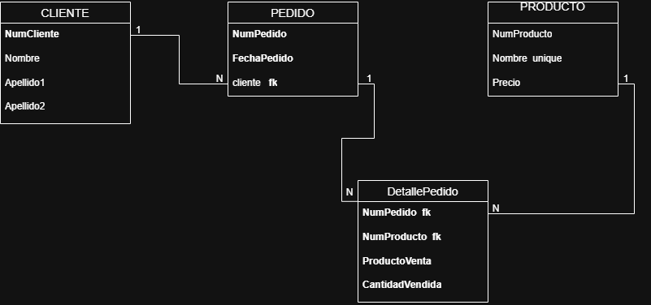

--

# Diccionario de Datos Ejercicio 5 Versión 1

---

# 1. Información General

| Campo | Información |
| :----- | :---------- |
| Proyecto | Sistema de Gestión de Empleados y Departamentos |
| Versión | 1.0 |
| Fecha | Junio 2026 |
| Elaboró | Julio Cesar Lugo Rodriguez |
| SGBD |  SQL Server |

---

# 2. Descripción de la Base de Datos

La base de datos administra la información de empleados, departamentos, proyectos y dependientes de una empresa.

Permite registrar los empleados, los departamentos donde trabajan, los proyectos que controla cada departamento, las ubicaciones de los departamentos y las horas trabajadas por cada empleado en un proyecto.

Las tablas principales son:

- EMPLOYEE
- DEPARTAMENT
- PROJECT
- WORKS_ON
- LOCATIONS
- DEPENDENT

Su objetivo es mantener organizada la información administrativa y laboral de la empresa.

---

# 3. Catálogo de Restricciones

| Catálogo | Significado |
| :-------- | :---------- |
| PK | Primary Key |
| FK | Foreign Key |
| NN | Not Null |
| UQ | Unique |
| AI | Auto Increment o Identity |
| CK | Check |
| DF | Default |

---

# 4. Diccionario de Datos

## Tabla: EMPLOYEE

### Descripción

Almacena la información general de los empleados.

| Campo | Tipo | Longitud | Restricciones | Descripción |
| :---- | :--- | :------- | :------------ | :---------- |
| Ssn | CHAR | 9 | PK, NN | Número de seguro social |
| FirstName | VARCHAR | 40 | NN | Nombre |
| Lastname | VARCHAR | 40 | NN | Apellido |
| Bdate | DATE | - | NN | Fecha de nacimiento |
| Address | VARCHAR | 120 | NN | Dirección |
| Salary | DECIMAL | 10,2 | NN | Salario |
| Sex | CHAR | 1 | NN | Sexo |
| NameProject | VARCHAR | 60 | NULL | Proyecto asignado |
| NumberProject | INT | 4 | NULL | Número del proyecto |
| Jef | CHAR | 9 | FK | Supervisor |

---

## Tabla: DEPARTAMENT

### Descripción

Almacena la información de los departamentos.

| Campo | Tipo | Longitud | Restricciones | Descripción |
| :---- | :--- | :------- | :------------ | :---------- |
| Name | VARCHAR | 60 | NN | Nombre del departamento |
| Number | INT | 4 | PK, NN | Número del departamento |
| Ssn_fk | CHAR | 9 | FK, UQ | Gerente del departamento |
| Startdate | DATE | - | NN | Fecha de inicio del gerente |

---

## Tabla: PROJECT

### Descripción

Almacena la información de los proyectos.

| Campo | Tipo | Longitud | Restricciones | Descripción |
| :---- | :--- | :------- | :------------ | :---------- |
| Name | VARCHAR | 60 | NN | Nombre del proyecto |
| Number | INT | 4 | PK, NN | Número del proyecto |
| Location | VARCHAR | 80 | NN | Ubicación |
| NameProject | VARCHAR | 60 | NULL | Nombre alterno del proyecto |
| NumberProject | INT | 4 | NULL | Número alterno del proyecto |

---

## Tabla: WORKS_ON

### Descripción

Relaciona los empleados con los proyectos en los que trabajan.

| Campo | Tipo | Longitud | Restricciones | Descripción |
| :---- | :--- | :------- | :------------ | :---------- |
| Ssn | CHAR | 9 | PK, FK | Empleado |
| NameProject | VARCHAR | 60 | PK | Proyecto |
| NumberProject | INT | PK | Número del proyecto |
| Hours | DECIMAL | 5,2 | NN | Horas trabajadas |

---

## Tabla: LOCATIONS

### Descripción

Almacena las ubicaciones donde opera cada departamento.

| Campo | Tipo | Longitud | Restricciones | Descripción |
| :---- | :--- | :------- | :------------ | :---------- |
| NumLocation | INT | 4 | PK, NN | Identificador |
| NameDepartament | VARCHAR | 60 | NN | Nombre del departamento |
| NumberDepartament | INT | FK | Departamento |
| Location | VARCHAR | 80 | NN | Ubicación |

---

## Tabla: DEPENDENT

### Descripción

Almacena los dependientes de cada empleado.

| Campo | Tipo | Longitud | Restricciones | Descripción |
| :---- | :--- | :------- | :------------ | :---------- |
| Name | VARCHAR | 60 | PK | Nombre del dependiente |
| Sex | CHAR | 1 | NN | Sexo |
| Birthday | DATE | NN | Fecha de nacimiento |
| Relationship | VARCHAR | 30 | NN | Parentesco |
| Ssn | CHAR | 9 | FK | Empleado propietario |

---

# 5. Relaciones en la Base de Datos

| Relación | Cardinalidad | Descripción |
| :-------- | :----------- | :---------- |
| EMPLOYEE → DEPARTAMENT | 1 : 1 | Un empleado administra un departamento. |
| DEPARTAMENT → EMPLOYEE | 1 : N | Un departamento tiene varios empleados. |
| DEPARTAMENT → PROJECT | 1 : N | Un departamento controla varios proyectos. |
| DEPARTAMENT → LOCATIONS | 1 : N | Un departamento posee varias ubicaciones. |
| EMPLOYEE → DEPENDENT | 1 : N | Un empleado puede tener varios dependientes. |
| EMPLOYEE → WORKS_ON | 1 : N | Un empleado trabaja en varios proyectos. |
| PROJECT → WORKS_ON | 1 : N | Un proyecto tiene varios empleados asignados. |

---

# 6. Matriz de Claves Foráneas

| Tabla | Campo FK | Referencias |
| :---- | :------- | :---------- |
| DEPARTAMENT | Ssn_fk | EMPLOYEE(Ssn) |
| LOCATIONS | NumberDepartament | DEPARTAMENT(Number) |
| DEPENDENT | Ssn | EMPLOYEE(Ssn) |
| WORKS_ON | Ssn | EMPLOYEE(Ssn) |

---

# 7. Integridad Referencial

| Clave | Regla |
| :---- | :---- |
| DEPARTAMENT.Ssn_fk | Debe existir un empleado registrado. |
| DEPENDENT.Ssn | Debe existir un empleado registrado. |
| LOCATIONS.NumberDepartament | Debe existir un departamento. |
| WORKS_ON.Ssn | Debe existir un empleado registrado. |

---

# 8. Reglas del Negocio

| Clave | Regla |
| :---- | :---- |
| RN-01 | Un departamento tiene un único gerente. |
| RN-02 | Un gerente debe ser un empleado registrado. |
| RN-03 | Un departamento puede controlar varios proyectos. |
| RN-04 | Un empleado puede participar en varios proyectos. |
| RN-05 | Un proyecto puede tener varios empleados. |
| RN-06 | Cada registro de WORKS_ON debe indicar las horas trabajadas. |
| RN-07 | Un empleado puede registrar varios dependientes. |
| RN-08 | Un departamento puede existir en varias ubicaciones. |

---

# 9. Diagrama Relacional
### Modelo E-R
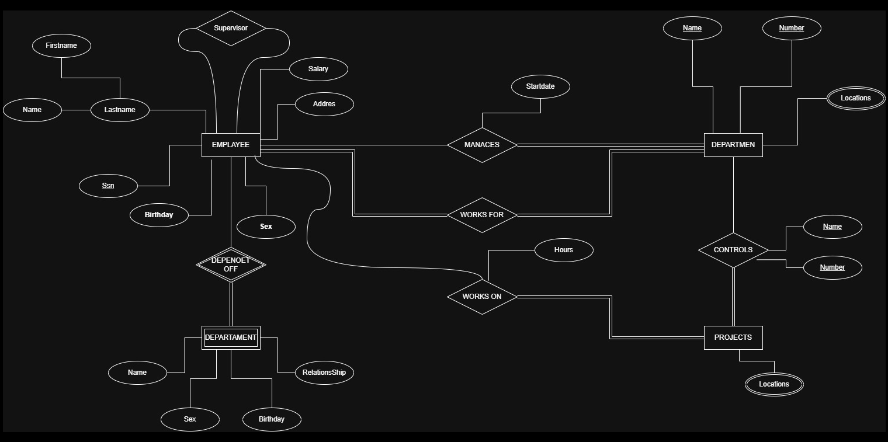

### Modelo Relacional Versión 1
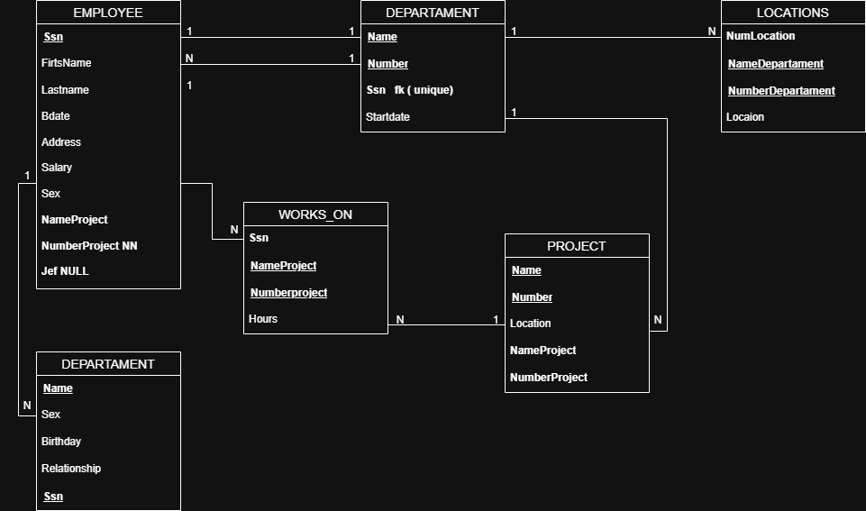

--

# Diccionario de Datos Ejercicio 5 Versión 2

---

# 1. Información General

| Campo | Información |
| :----- | :---------- |
| Proyecto | Sistema de Gestión de Empleados, Departamentos y Proyectos |
| Versión | 2.0 |
| Fecha | Junio 2026 |
| Elaboró | Julio Cesar Lugo Rodrigez |
| SGBD | SQL Server |

---

# 2. Descripción de la Base de Datos

La base de datos administra la información de los empleados, departamentos, proyectos, ubicaciones y dependientes de una empresa.

Permite registrar los empleados, el departamento al que pertenecen, el gerente de cada departamento, los proyectos administrados por los departamentos, las ubicaciones donde operan y los dependientes de cada empleado.

Las tablas principales son:

- EMPLOYEE
- DEPARTAMENT
- PROJECT
- WORKS_ON
- LOCATIONS
- DEPENDENT

El objetivo principal de la base de datos es centralizar la información administrativa de la empresa y garantizar la integridad de las relaciones entre empleados, departamentos y proyectos.

---

# 3. Catálogo de Restricciones

| Catálogo | Significado |
| :-------- | :---------- |
| PK | Primary Key |
| FK | Foreign Key |
| NN | Not Null |
| UQ | Unique |
| AI | Auto Increment o Identity |
| CK | Check |
| DF | Default |

---

# 4. Diccionario de Datos

## Tabla: EMPLOYEE

### Descripción

Almacena la información general de los empleados de la empresa.

| Campo | Tipo | Longitud | Restricciones | Descripción |
| :---- | :--- | :------- | :------------ | :---------- |
| NumEmploy | INT | 4 | PK, NN | Identificador del empleado |
| Ssn | CHAR | 11 | UQ, NN | Número de Seguro Social |
| Lastname | VARCHAR | 50 | NN | Apellido del empleado |
| Bdate | DATE | - | NN | Fecha de nacimiento |
| Address | VARCHAR | 120 | NN | Dirección |
| Salary | DECIMAL | 10,2 | NN | Salario |
| Sex | CHAR | 1 | NN | Sexo |
| NumberDepart | INT | 4 | FK, NN | Departamento al que pertenece |
| Jef | INT | 4 | FK | Supervisor inmediato |

---

## Tabla: DEPARTAMENT

### Descripción

Almacena la información de los departamentos de la empresa.

| Campo | Tipo | Longitud | Restricciones | Descripción |
| :---- | :--- | :------- | :------------ | :---------- |
| Number | INT | 4 | PK, NN | Número del departamento |
| Name | VARCHAR | 60 | NN | Nombre del departamento |
| Manager | INT | 4 | FK, UQ, NN | Empleado que administra el departamento |
| Startdate | DATE | - | NN | Fecha de inicio del gerente |

---

## Tabla: PROJECT

### Descripción

Almacena la información de los proyectos administrados por los departamentos.

| Campo | Tipo | Longitud | Restricciones | Descripción |
| :---- | :--- | :------- | :------------ | :---------- |
| NumberProject | INT | 4 | PK, NN | Número del proyecto |
| NumberDepartament | INT | 4 | FK, NN | Departamento responsable |
| Location | VARCHAR | 80 | NN | Ubicación del proyecto |

---

## Tabla: WORKS_ON

### Descripción

Registra la participación de los empleados en los proyectos y las horas trabajadas.

| Campo | Tipo | Longitud | Restricciones | Descripción |
| :---- | :--- | :------- | :------------ | :---------- |
| NameProject | VARCHAR | 60 | PK | Nombre del proyecto |
| NumberProject | INT | 4 | PK, FK | Proyecto asignado |
| Hours | DECIMAL | 5,2 | NN | Horas trabajadas |

---

## Tabla: LOCATIONS

### Descripción

Almacena las ubicaciones donde opera cada departamento.

| Campo | Tipo | Longitud | Restricciones | Descripción |
| :---- | :--- | :------- | :------------ | :---------- |
| NumLocation | INT | 4 | PK, NN | Identificador de la ubicación |
| NumberDepartament | INT | 4 | FK, NN | Departamento al que pertenece |
| Location | VARCHAR | 80 | NN | Dirección o ubicación |

---

## Tabla: DEPENDENT

### Descripción

Almacena la información de los dependientes de los empleados.

| Campo | Tipo | Longitud | Restricciones | Descripción |
| :---- | :--- | :------- | :------------ | :---------- |
| NumDepend | INT | 4 | PK, NN | Identificador del dependiente |
| Name | VARCHAR | 60 | NN | Nombre del dependiente |
| NumEmploy | INT | 4 | FK, NN | Empleado al que pertenece |
| Sex | CHAR | 1 | NN | Sexo |
| Birthday | DATE | - | NN | Fecha de nacimiento |
| Relationship | VARCHAR | 30 | NN | Parentesco con el empleado |

---

# 5. Relaciones en la Base de Datos

| Relación | Cardinalidad | Descripción |
| :------- | :----------- | :---------- |
| DEPARTAMENT → EMPLOYEE | 1 : N | Un departamento tiene varios empleados. |
| EMPLOYEE → DEPARTAMENT | 1 : 1 | Un empleado puede administrar un departamento. |
| DEPARTAMENT → PROJECT | 1 : N | Un departamento administra varios proyectos. |
| DEPARTAMENT → LOCATIONS | 1 : N | Un departamento puede tener varias ubicaciones. |
| EMPLOYEE → DEPENDENT | 1 : N | Un empleado puede registrar varios dependientes. |
| PROJECT → WORKS_ON | 1 : N | Un proyecto puede tener varios registros de trabajo. |

---

# 6. Matriz de Claves Foráneas

| Tabla | Campo FK | Referencias |
| :---- | :------- | :---------- |
| EMPLOYEE | NumberDepart | DEPARTAMENT(Number) |
| EMPLOYEE | Jef | EMPLOYEE(NumEmploy) |
| DEPARTAMENT | Manager | EMPLOYEE(NumEmploy) |
| PROJECT | NumberDepartament | DEPARTAMENT(Number) |
| LOCATIONS | NumberDepartament | DEPARTAMENT(Number) |
| DEPENDENT | NumEmploy | EMPLOYEE(NumEmploy) |
| WORKS_ON | NumberProject | PROJECT(NumberProject) |

---

# 7. Integridad Referencial

| Clave | Regla |
| :---- | :---- |
| EMPLOYEE.NumberDepart | Debe existir un departamento registrado. |
| EMPLOYEE.Jef | Debe existir previamente un empleado registrado como supervisor. |
| DEPARTAMENT.Manager | El gerente debe existir en la tabla EMPLOYEE. |
| PROJECT.NumberDepartament | El departamento debe existir previamente. |
| LOCATIONS.NumberDepartament | La ubicación debe pertenecer a un departamento existente. |
| DEPENDENT.NumEmploy | El empleado debe existir previamente. |
| WORKS_ON.NumberProject | El proyecto debe existir previamente. |

---

# 8. Reglas del Negocio

| Clave | Regla |
| :---- | :---- |
| RN-01 | Un empleado pertenece a un único departamento. |
| RN-02 | Un departamento puede tener varios empleados. |
| RN-03 | Cada departamento tiene un único gerente. |
| RN-04 | Un gerente debe ser un empleado registrado. |
| RN-05 | Un departamento puede administrar varios proyectos. |
| RN-06 | Un departamento puede tener una o varias ubicaciones. |
| RN-07 | Un empleado puede registrar varios dependientes. |
| RN-08 | Las horas trabajadas en un proyecto deben ser mayores que cero. |
| RN-09 | Todo proyecto debe pertenecer a un departamento. |

---

# 9. Diagrama Relacional
### Modelo E-R

### Modelo Relacional Versión 2
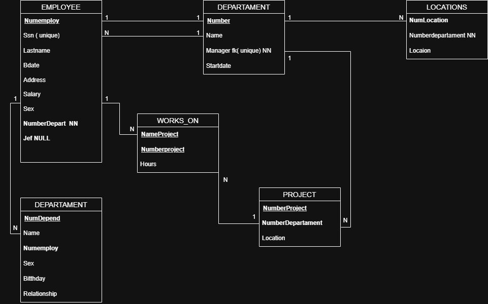

--

# Diccionario de Datos Ejercicio 6

---

# 1. Información General

| Campo | Información |
| :----- | :---------- |
| Proyecto | Sistema de Gestión Académica Universitaria |
| Versión | 1.0 |
| Fecha | Junio 2026 |
| Elaboró | Julio Cesar Lugo Rodriguez |
| SGBD | SQL Server |

---

# 2. Descripción de la Base de Datos

La base de datos administra la información correspondiente a un sistema de gestión académica universitaria, permitiendo almacenar la información de alumnos, profesores, materias, departamentos, credenciales, proyectos y dependientes.

El sistema registra la inscripción de alumnos en las materias, la asignación de profesores a las materias, la participación de profesores en proyectos institucionales, así como la administración de los departamentos a los que pertenecen y los dependientes asociados a cada profesor.

Las tablas principales que conforman la base de datos son:

- Alumno
- Credencial
- Materia
- Profesor
- Departamento
- Proyecto
- Dependiente
- Cursa
- Participa
- Imparte

El objetivo principal de la base de datos es mantener organizada la información académica y administrativa de la institución, garantizando la integridad de los datos y facilitando su consulta mediante relaciones entre las diferentes entidades.

---

# 3. Catálogo de Restricciones

| Catálogo | Significado |
| :-------- | :---------- |
| PK | Primary Key |
| FK | Foreign Key |
| NN | Not Null |
| UQ | Unique |
| AI | Auto Increment o Identity |
| CK | Check |
| DF | Default |

---

# 4. Diccionario de Datos

## Tabla: Alumno

### Descripción

Almacena la información general de los alumnos registrados en la institución.

| Campo | Tipo | Longitud | Restricciones | Descripción |
| :---- | :--- | :------- | :------------ | :---------- |
| Matricula | INT | 4 | PK, NN | Identificador único del alumno |
| Nombre | VARCHAR | 50 | NN | Nombre del alumno |
| Apellido1 | VARCHAR | 50 | NN | Primer apellido |
| Apellido2 | VARCHAR | 50 | NN | Segundo apellido |
| Correo | VARCHAR | 100 | NN, UQ | Correo electrónico institucional |
| Tel | VARCHAR | 15 | NN | Número telefónico del alumno |

---

## Tabla: Credencial

### Descripción

Almacena la información de la credencial asignada a cada alumno.

| Campo | Tipo | Longitud | Restricciones | Descripción |
| :---- | :--- | :------- | :------------ | :---------- |
| NumCredencial | INT | 4 | PK, NN | Número único de la credencial |
| FechaInscripcion | DATE | - | NN | Fecha de expedición de la credencial |
| Vigencia | DATE | - | NN | Fecha de vencimiento de la credencial |
| Matricula | INT | 4 | FK, NN, UQ | Alumno propietario de la credencial |

---

## Tabla: Materia

### Descripción

Almacena la información de las materias impartidas en la institución.

| Campo | Tipo | Longitud | Restricciones | Descripción |
| :---- | :--- | :------- | :------------ | :---------- |
| ClaveMateria | VARCHAR | 10 | PK, NN | Clave única de la materia |
| NombreMat | VARCHAR | 100 | NN | Nombre de la materia |
| Creditos | INT | 2 | NN | Número de créditos asignados |

---

## Tabla: Profesor

### Descripción

Almacena la información general de los profesores de la institución.

| Campo | Tipo | Longitud | Restricciones | Descripción |
| :---- | :--- | :------- | :------------ | :---------- |
| NumProf | INT | 4 | PK, NN | Identificador único del profesor |
| Nombre | VARCHAR | 50 | NN | Nombre del profesor |
| Apellido1 | VARCHAR | 50 | NN | Primer apellido |
| Apellido2 | VARCHAR | 50 | NN | Segundo apellido |
| NumDepto | INT | 4 | FK, NN | Departamento al que pertenece |

---

## Tabla: Departamento

### Descripción

Almacena la información de los departamentos académicos de la institución.

| Campo | Tipo | Longitud | Restricciones | Descripción |
| :---- | :--- | :------- | :------------ | :---------- |
| NumDepto | INT | 4 | PK, NN | Identificador del departamento |
| Nombre | VARCHAR | 60 | NN | Nombre del departamento |
| Edificio | VARCHAR | 40 | NN | Edificio donde se ubica el departamento |

---

## Tabla: Proyecto

### Descripción

Almacena la información de los proyectos institucionales en los que participan los profesores.

| Campo | Tipo | Longitud | Restricciones | Descripción |
| :---- | :--- | :------- | :------------ | :---------- |
| NumProyecto | INT | 4 | PK, NN | Identificador único del proyecto |
| NombreProyecto | VARCHAR | 100 | NN | Nombre del proyecto |
| Presupuesto | DECIMAL | 12,2 | NN | Presupuesto asignado al proyecto |

---

## Tabla: Dependiente

### Descripción

Almacena la información de los dependientes registrados para cada profesor.

| Campo | Tipo | Longitud | Restricciones | Descripción |
| :---- | :--- | :------- | :------------ | :---------- |
| IdDependiente | INT | 4 | PK, NN | Identificador único del dependiente |
| Nombre | VARCHAR | 100 | NN | Nombre completo del dependiente |
| FechaNaci | DATE | - | NN | Fecha de nacimiento del dependiente |
| Parentesco | VARCHAR | 30 | NN | Parentesco con el profesor |
| NumProf | INT | 4 | FK, NN | Profesor al que pertenece el dependiente |

---

## Tabla: Cursa

### Descripción

Relaciona a los alumnos con las materias que cursan y almacena información de su inscripción y calificación final.

| Campo | Tipo | Longitud | Restricciones | Descripción |
| :---- | :--- | :------- | :------------ | :---------- |
| Matricula | INT | 4 | PK, FK, NN | Alumno inscrito |
| ClaveMateria | VARCHAR | 10 | PK, FK, NN | Materia cursada |
| FechaInscripcion | DATE | - | NN | Fecha en la que el alumno se inscribió |
| CaliFinal | DECIMAL | 4,2 | CK | Calificación final obtenida por el alumno |

---

## Tabla: Imparte

### Descripción

Relaciona a los profesores con las materias que imparten.

| Campo | Tipo | Longitud | Restricciones | Descripción |
| :---- | :--- | :------- | :------------ | :---------- |
| ClaveMateria | VARCHAR | 10 | PK, FK, NN | Materia impartida |
| NumProf | INT | 4 | PK, FK, NN | Profesor que imparte la materia |

---

## Tabla: Participa

### Descripción

Relaciona a los profesores con los proyectos institucionales en los que participan.

| Campo | Tipo | Longitud | Restricciones | Descripción |
| :---- | :--- | :------- | :------------ | :---------- |
| NumProf | INT | 4 | PK, FK, NN | Profesor participante |
| NumProyecto | INT | 4 | PK, FK, NN | Proyecto en el que participa |
| FechaInicio | DATE | - | NN | Fecha de inicio de participación en el proyecto |

---

# 5. Relaciones en la Base de Datos

| Relación | Cardinalidad | Descripción |
| :-------- | :----------- | :---------- |
| Alumno → Credencial | 1 : 1 | Cada alumno posee una única credencial y cada credencial pertenece a un solo alumno. |
| Alumno → Cursa | 1 : N | Un alumno puede cursar varias materias. |
| Materia → Cursa | 1 : N | Una materia puede ser cursada por varios alumnos. |
| Profesor → Imparte | 1 : N | Un profesor puede impartir varias materias. |
| Materia → Imparte | 1 : N | Una materia es impartida por un profesor. |
| Departamento → Profesor | 1 : N | Un departamento puede tener varios profesores asignados. |
| Profesor → Dependiente | 1 : N | Un profesor puede registrar varios dependientes. |
| Profesor → Participa | 1 : N | Un profesor puede participar en varios proyectos. |
| Proyecto → Participa | 1 : N | Un proyecto puede tener varios profesores participantes. |

---

# 6. Matriz de Claves Foráneas

| Tabla | Campo FK | Referencias |
| :---- | :------- | :---------- |
| Credencial | Matricula | Alumno(Matricula) |
| Profesor | NumDepto | Departamento(NumDepto) |
| Dependiente | NumProf | Profesor(NumProf) |
| Cursa | Matricula | Alumno(Matricula) |
| Cursa | ClaveMateria | Materia(ClaveMateria) |
| Imparte | NumProf | Profesor(NumProf) |
| Imparte | ClaveMateria | Materia(ClaveMateria) |
| Participa | NumProf | Profesor(NumProf) |
| Participa | NumProyecto | Proyecto(NumProyecto) |

---

# 7. Integridad Referencial

| Clave | Regla |
| :---- | :---- |
| Credencial.Matricula | Debe existir previamente un alumno registrado. |
| Profesor.NumDepto | Debe existir previamente un departamento registrado. |
| Dependiente.NumProf | Debe existir previamente un profesor registrado. |
| Cursa.Matricula | Debe existir previamente un alumno registrado. |
| Cursa.ClaveMateria | Debe existir previamente una materia registrada. |
| Imparte.NumProf | Debe existir previamente un profesor registrado. |
| Imparte.ClaveMateria | Debe existir previamente una materia registrada. |
| Participa.NumProf | Debe existir previamente un profesor registrado. |
| Participa.NumProyecto | Debe existir previamente un proyecto registrado. |

---

# 8. Reglas del Negocio

| Clave | Regla |
| :---- | :---- |
| RN-01 | Cada alumno debe estar identificado mediante una matrícula única. |
| RN-02 | Cada alumno puede poseer únicamente una credencial. |
| RN-03 | Una credencial pertenece únicamente a un alumno. |
| RN-04 | Un alumno puede inscribirse en una o varias materias. |
| RN-05 | Una materia puede ser cursada por varios alumnos. |
| RN-06 | Cada profesor pertenece a un único departamento. |
| RN-07 | Un departamento puede tener varios profesores. |
| RN-08 | Un profesor puede impartir una o varias materias. |
| RN-09 | Una materia debe ser impartida por un profesor. |
| RN-10 | Un profesor puede participar en uno o varios proyectos. |
| RN-11 | Un proyecto puede tener varios profesores participantes. |
| RN-12 | Un profesor puede registrar cero o varios dependientes. |
| RN-13 | La fecha de inscripción de una credencial debe ser válida. |
| RN-14 | La vigencia de la credencial debe ser posterior a la fecha de inscripción. |
| RN-15 | La calificación final registrada en una materia debe estar dentro de la escala permitida por la institución. |

---

# 9. Diagrama Relacional
### Modelo E-R
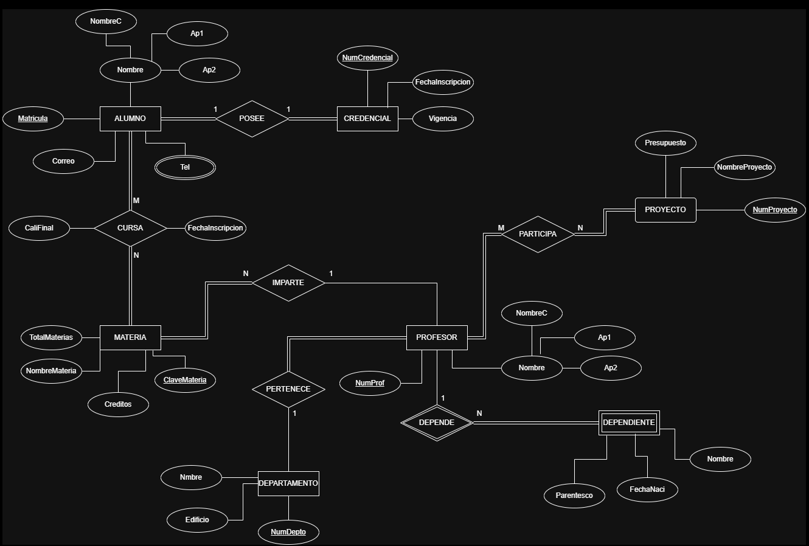

### Modelo Relacional
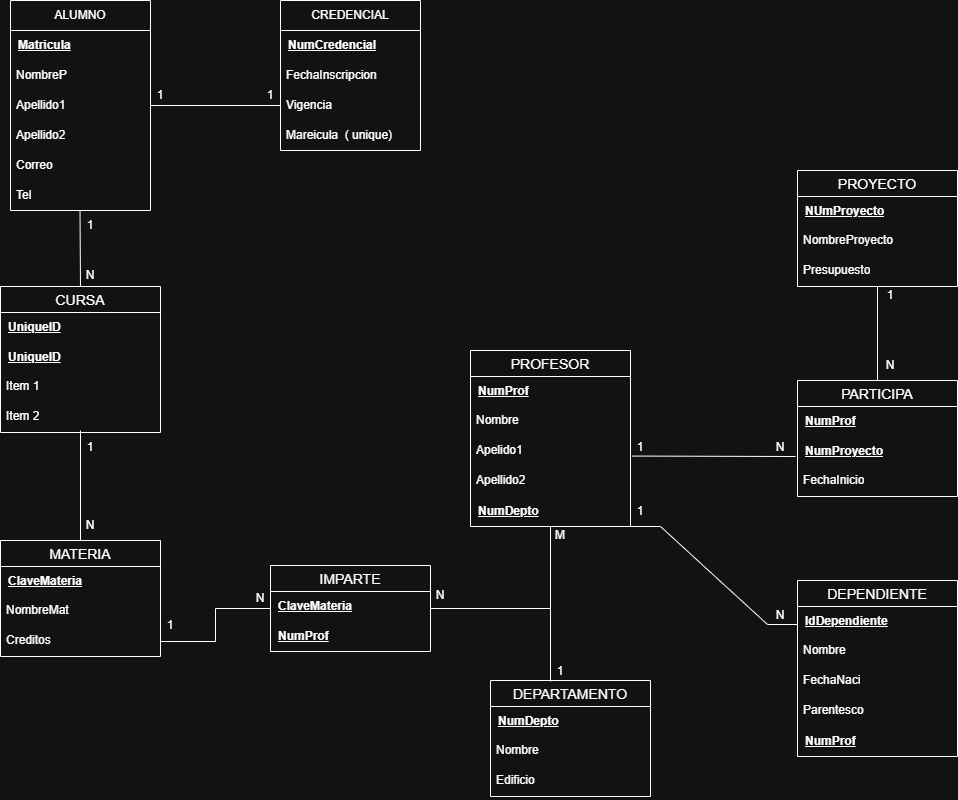

# Fin del Documento
 

